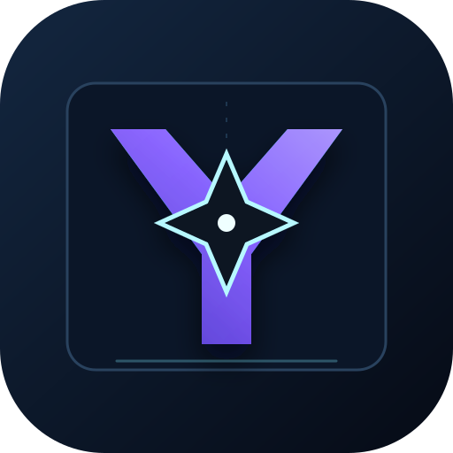
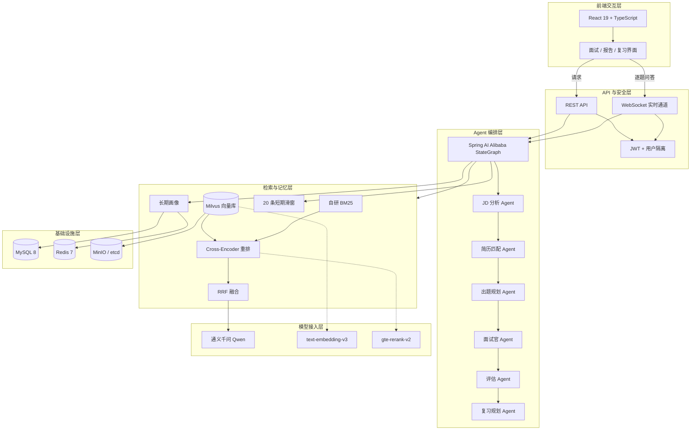
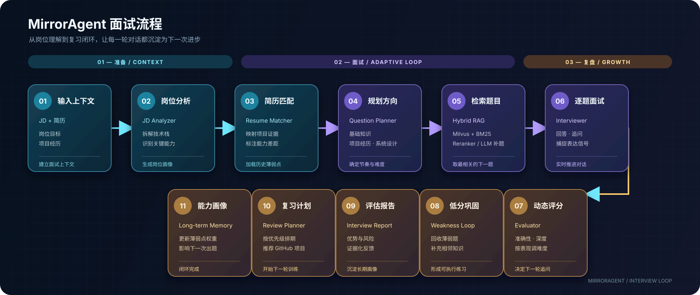

<div align="center">
  
  <h1>MirrorAgent</h1>
  <p><strong>越练越懂你的 AI 求职面试教练</strong></p>
  <p>不抽公共题库、不聊泛泛八股 —— 上传目标岗位 JD 与个人简历、导入心仪公司真题，AI 针对你的项目经历分三阶段仿真追问、按答题表现动态调难度</p>
  <p>实时评分与诊断报告 · 个性化复习计划与开源项目推荐 · 薄弱点跨面试长期追踪、越练越准 · 概念精讲 / 项目亮点提炼 / 技术对比随问随练</p>
  <p>
    
    
    
    
    
    
  </p>
</div>

[](https://github.com/aroura-dev/ai-interview-coach/actions/workflows/ci.yml)

MirrorAgent 根据岗位 JD、候选人简历和个人题库，自动完成岗位分析、简历匹配、出题规划、逐题面试、实时评分、动态追问、能力评估与复习计划生成。项目采用 Spring AI Alibaba Graph 编排面试流程，并结合 Milvus、BM25、Cross-Encoder 重排和长期用户画像实现更贴近目标岗位的面试体验。

## 核心能力

- **完整面试闭环**：JD 分析、简历匹配、出题、问答、评分、报告和复习计划一次完成。
- **混合 RAG 检索**：Milvus 向量召回与 BM25 关键词召回合并去重，再通过 Cross-Encoder 或 LLM 重排。
- **自适应面试节奏**：按基础知识、项目经历、系统设计三个阶段推进，并根据连续答题表现调整难度。
- **人在环实时交互**：通过 WebSocket 和阻塞队列逐题等待用户回答，实时推送阶段、评分和报告。
- **长期能力画像**：记录与当前 JD 相关的历史薄弱点，用于后续针对性出题。
- **可插拔技能系统**：内置快速测验、概念精讲、项目亮点提炼和技术对比四种多轮 Skill。
- **离线 RAG 评估**：支持 Recall@10、Recall@20、MRR 以及忠实度、相关性、完整性评估。
- **学习资源推荐**：复习规划 Agent 可按需调用 GitHub 搜索工具推荐真实项目。

## 工程验证

- `mvn test`：23/23 通过，0 failures，0 errors。
- Redis 一致性测试：6/6 通过。
- 前端 Vitest：4/4 通过。
- Redis 画像缓存使用 2 小时 TTL；写失败时清理陈旧键且不阻断主流程；miss 后回源 MySQL 并回填。
- RAG 离线评测：50 条人工标注集 Recall@10=0.7833、Recall@20=0.8567。
- MRR=1.0 来自当前 50 条小样本，存在过拟合风险，需扩大标注集后复核，不作为主要效果指标。
- 并发会话使用独立 `LinkedBlockingQueue + 专用线程池`，与图异步节点隔离。

> 测试结果为本机环境口径，不代表线上生产数据。

## 系统架构

项目采用“前端交互层 → API 与安全层 → Agent 编排层 → 检索与记忆层 → 模型接入层 → 基础设施层”的分层设计，保证 Agent 编排、RAG、记忆和实时交互彼此解耦。



| 层 | 核心职责 | 主流技术 |
|---|---|---|
| 前端交互层 | 简历/JD 上传、逐题面试、报告和复习界面 | React 19、TypeScript、Zustand、Vite |
| API 与安全层 | REST/WebSocket、实时推送、鉴权和用户隔离 | Spring Boot 3.4、Spring Security、JWT |
| Agent 编排层 | 固定流程编排和单 Agent 可替换调优 | Spring AI Alibaba Graph、StateGraph |
| 检索与记忆层 | 双路召回、重排融合、短期上下文与长期画像 | Milvus、BM25、Cross-Encoder、RRF、MySQL、Redis |
| 模型接入层 | 对话、向量化和重排模型服务 | 通义千问、text-embedding-v3、gte-rerank-v2 |
| 基础设施层 | 本地依赖启动、对象存储和向量服务支撑 | Docker Compose、MinIO、etcd |
| 质量保障 | 单测、离线检索评测、Redis 一致性验证 | JUnit 5、Mockito、GitHub Actions |

详细数据流、Agent 职责和设计取舍见 [`docs/ARCHITECTURE.md`](docs/ARCHITECTURE.md)，业务接口、事务与测试证据见 [`docs/EVIDENCE.md`](docs/EVIDENCE.md)。

## 面试流程

<p align="center">
  
</p>

## 技术栈

| 模块 | 技术 |
| --- | --- |
| 后端 | Java 21、Spring Boot 3.4、Spring AI Alibaba 1.1 |
| 大模型 | 通义千问 DashScope、text-embedding-v3、gte-rerank-v2 |
| 前端 | React 19、TypeScript、Vite 8、Tailwind CSS 4、Zustand |
| 检索 | Milvus 2.4、BM25、Cross-Encoder / LLM Rerank |
| 存储 | MySQL 8、Redis 7 |
| 通信 | REST、WebSocket |
| 文档解析 | Apache PDFBox、Apache POI |
| 基础设施 | Docker Compose、etcd、MinIO |

## 项目结构

```text
MirrorAgent/
├── MirrorAgent-java/                         # Spring Boot 后端
│   ├── src/main/java/com/mirror/agent/
│   │   ├── agent/                            # 专职 Agent
│   │   ├── graph/                            # 面试流程编排与动态调度
│   │   ├── rag/                              # 混合检索、重排与离线评估
│   │   ├── memory/                           # 用户画像、Redis 与 MySQL
│   │   ├── skill/                            # 多轮技能系统
│   │   ├── loader/                           # PDF、DOCX、网页与题库解析
│   │   ├── auth/                             # 用户与 JWT 认证
│   │   ├── handler/                          # REST / WebSocket 入口
│   │   └── model/                            # 领域模型
│   ├── data/questions/                       # 示例面试题库
│   ├── data/eval/                            # RAG 评估数据与报告
│   └── docker-compose.yml                    # Milvus、Redis、MySQL
└── MirrorAgent-web/                          # React 前端
    └── src/
        ├── components/                       # 面试与报告 UI
        ├── api/                              # REST / WebSocket 客户端
        ├── store/                            # Zustand 状态
        └── hooks/                            # WebSocket 生命周期
```

## 快速开始

### 1. 环境要求

- JDK 21
- Maven 3.9+
- Node.js 20.19+
- Docker Desktop 与 Docker Compose
- DashScope API Key

### 2. 配置后端

```bash
cd MirrorAgent-java
cp .env.example .env
```

编辑 `.env`，至少设置：

```dotenv
DASHSCOPE_API_KEY=sk-your-api-key
JWT_SECRET=replace-with-a-long-random-secret
```

### 3. 启动基础设施

```bash
docker compose up -d --wait
```

该命令将启动 Milvus、etcd、MinIO、Redis 和 MySQL。

### 4. 启动后端

```bash
mvn spring-boot:run
```

后端默认监听 `http://localhost:9090`；存活检查为 `http://localhost:9090/health`，包含数据库与 Redis 的深度健康检查为 `http://localhost:9090/actuator/health`。

### 5. 启动前端

```bash
cd ../MirrorAgent-web
npm ci
npm run dev
```

浏览器访问 `http://localhost:5173`。Vite 会自动把 `/api` 和 `/ws` 转发到后端。

### 6. 可选：完整 Docker 一键启动

在 `MirrorAgent-java` 目录执行：

```bash
make app-up
```

该 profile 会在基础设施就绪后构建并启动后端与前端：前端 `http://localhost:5173`，后端 `http://localhost:9090`，健康检查 `http://localhost:9090/actuator/health`。停止完整环境使用 `make app-down`。

## 自定义题库

前端支持上传 PDF、DOCX、TXT 和 Markdown 题库。后端会执行：

1. 文件解析与文本提取。
2. 使用 LLM 识别题目、参考答案、难度和技能标签。
3. 写入按用户隔离的 Milvus collection。
4. 同步构建 BM25 内存索引。
5. 使用 SHA-256 文件摘要避免重复导入。

`MirrorAgent-java/data/questions` 已提供 Go、MySQL、Redis、消息队列和分布式系统示例题库。

## RAG 离线评估

```bash
# 准备 Milvus 数据与 manifest
mvn spring-boot:run -Dspring-boot.run.arguments="eval --prepare"

# 生成评估数据集
mvn spring-boot:run -Dspring-boot.run.arguments="eval --gen-dataset"

# 执行评估
mvn spring-boot:run -Dspring-boot.run.arguments="eval --execute"
```

评估报告输出到 `MirrorAgent-java/data/eval/reports`。

## 配置说明

| 环境变量 | 默认值 | 说明 |
| --- | --- | --- |
| `DASHSCOPE_API_KEY` | 无 | DashScope API Key，必填 |
| `LLM_MODEL` | `qwen-plus` | 对话模型 |
| `EMBEDDING_MODEL` | `text-embedding-v3` | 向量模型 |
| `RERANKER_TYPE` | `cross-encoder` | `cross-encoder`、`llm` 或 `none` |
| `RERANK_MODEL` | `gte-rerank-v2` | Cross-Encoder 模型 |
| `MILVUS_HOST` | `localhost` | Milvus 地址 |
| `REDIS_HOST` | `localhost` | Redis 地址 |
| `MYSQL_URL` | `localhost:3308/mirror_agent` | MySQL JDBC URL，与 Compose 端口一致 |
| `MYSQL_USERNAME` / `MYSQL_PASSWORD` | `mirror_agent` | 后端专用 MySQL 应用账号 |
| `MYSQL_ROOT_PASSWORD` | `interview` | MySQL root 密码，仅容器初始化使用 |
| `MINIO_ACCESS_KEY` / `MINIO_SECRET_KEY` | `minioadmin` | Milvus 对象存储凭据 |
| `JWT_SECRET` | 开发默认值 | JWT 签名密钥，生产环境必须替换 |
| `GITHUB_TOKEN` | 空 | GitHub 搜索工具 Token，可选 |

## 安全提示

- 不要提交 `.env`、真实 API Key、GitHub Token 或生产数据库密码。
- 部署前必须替换 JWT、MySQL 应用账号、MySQL root 和 MinIO 的默认凭据。
- 当前 Docker Compose 和跨域配置面向本地开发，公网部署前应限制端口和允许来源。
- 上传文件和 WebSocket 消息需要在生产环境增加更严格的大小、频率与内容校验。

## 开发验证

```bash
# 后端
cd MirrorAgent-java
mvn test

# 前端
cd MirrorAgent-web
npm test
npm run lint
npm run build
```

欢迎通过 Issue 和 Pull Request 提交改进建议。
