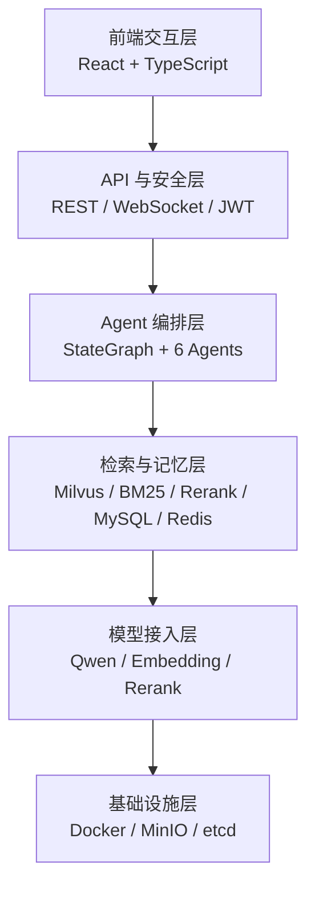
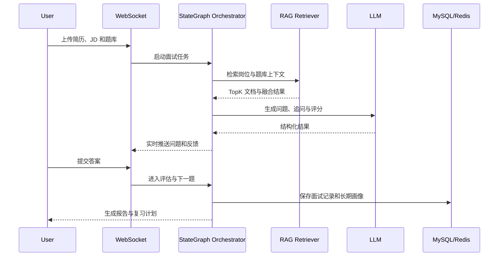
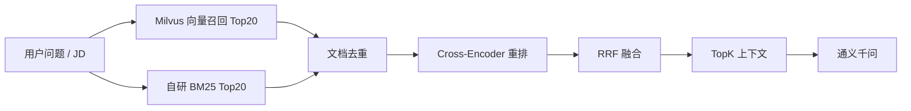

# MirrorAgent 系统架构

## 1. 架构目标

- 将 JD 分析、简历匹配、出题、面试、评估和复习拆成可替换的专职 Agent。
- 将向量检索、关键词检索、重排和融合从业务流程中解耦。
- 支持 WebSocket 逐题交互、多轮上下文和跨面试长期画像。
- 对检索效果、Redis 一致性和后端行为提供自动化验证。

## 2. 分层架构

## 3. 面试主流程

## 4. 六个 Agent

| Agent | 职责 | 输入 | 输出 |
|---|---|---|---|
| JD 分析 | 提取岗位要求、技能和重点 | JD 文本 | 结构化岗位画像 |
| 简历匹配 | 对比简历与岗位要求 | 简历、岗位画像 | 匹配分与缺口 |
| 出题规划 | 选择知识点和难度 | 岗位、画像、题库 | 分阶段题目候选 |
| 面试官 | 逐题提问、追问和实时反馈 | 会话状态、题目 | 问题与反馈 |
| 评估 | 对回答进行评分与归因 | 题目、回答、参考答案 | 分数与薄弱点 |
| 复习规划 | 生成个性化复习计划 | 薄弱点、历史记录 | 复习任务与周期 |

## 5. RAG 检索链路

- 双路召回互补：向量负责语义相似，BM25 负责关键词和术语精确匹配。
- 先去重再重排，减少重复文档对 TopK 的挤占。
- RRF 作为融合兜底，避免单一排序策略波动过大。

## 6. 记忆与一致性

- 短期记忆：每个会话保留最近 20 条对话，控制上下文长度和 Token 成本。
- 长期画像：MySQL 作为持久化真源，Redis 作为读缓存。
- 写路径：先 MySQL 后 Redis；Redis 写失败不影响主流程，并尽力删除陈旧缓存。
- 读路径：先 Redis，miss 后回源 MySQL，并带 TTL 回填。
- 一致性边界：采用有界弱一致，不宣称强一致。

## 7. 并发与实时交互

- 每个 WebSocket 会话使用独立 `LinkedBlockingQueue`。
- 面试任务使用专用线程池，与图异步节点隔离，避免线程饥饿和死锁。
- JWT 鉴权与 userId 数据隔离保证会话边界。

## 8. 质量保障

- 后端测试：`23/23` 通过。
- Redis 一致性测试：`6/6` 通过。
- 50 条离线标注集：Recall@10 `0.7833`、Recall@20 `0.8567`。
- MRR `1.0` 仅在 50 条样本上成立，当前标记为过拟合风险，待扩充数据集。
- GitHub Actions 在 push 和 pull request 时自动执行后端测试。
